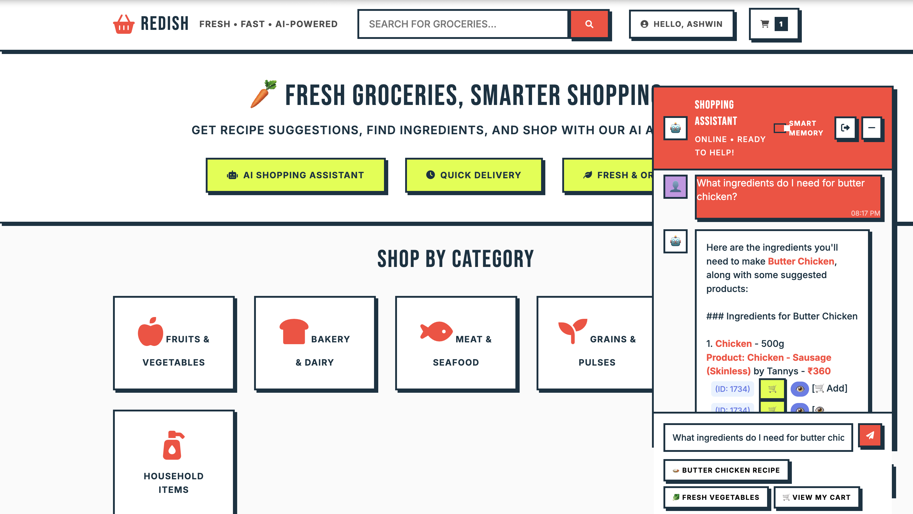

# 🤖 RediBuddy

**Short-term memory. Long-term friendship.**

RediBuddy is a lightweight, memory-backed AI assistant built using **Redis** and **OpenAI**. It mimics ChatGPT’s multi-chat interface with short-term memory using Redis as the memory store, letting users have quick, ephemeral conversations.

## App screenshots




---

## 🧠 What it does

- Interactive chatbot interface
- Leverages **Redis** to provide:
  - Super-fast conversation memory (session-based)
  - Smart response reuse using **LangCache** for **semantic caching**
- Conversations are tied to a unique session name and cleared at the end of the session.

---

## ⚙️ Tech Stack

- **Node.js** + **Express** (Backend API)
- **Redis** (Conversation store)
- **OpenAI API**
- **LangCache** (Semantic caching engine powered by Redis + embeddings)
- **HTML + CSS + Vanilla JS** (Frontend)

---

## 🚀 Getting Started

- **OpenAI API Key**

  Create an account and [create an API key](https://platform.openai.com/account/api-keys).

- Clone this repository:

  ```bash
  git clone https://github.com/booleanhunter/redibuddy.git
  cd redibuddy
  ```

- Configure environment variables

  Create a `.env` file at the root:

  ```bash
  OPENAI_API_KEY=your_openai_api_key
  REDIS_URL=your_redis_connection_string
  LANGCACHE_API_KEY="your_langcache_api_key"
  LANGCACHE_API_BASE_URL="your_langcache_api_base_url"
  LANGCACHE_CACHE_ID="your_langgache_cache_id"
  SERVER_PORT=3000
  MODEL_NAME="gpt-4o-mini"
  ```

  📝 Make sure to replace these placeholders with your real values before running the app.

### Option 1: Manual installation

#### ✅ Prerequisites

- **Node.js (v18 or higher)**
  [Download & Install Node.js](https://nodejs.org/)

- **Redis**
  
  You can either:

  - Install Redis locally: [Redis installation guide](https://redis.io/docs/getting-started/installation/)

  - Or, use docker:

  ```bash
    docker pull redis:8.0
    docker run --name redibuddy-redis -p 6379:6379 redis:8.0
  ```

  - Or use [Redis cloud](https://redis.io) (no installation required)

---

#### ✅ Setup

- Install dependencies

  `cd` into the project root and run:

  ```bash
  npm install
  ```

- Configure environment variables

  Replace the values in your `.env` file with your actual API key, Redis connection string, and desired server port.

- Start the server

  ```bash
  npm start
  ```

### Option 2:  🐳 Run with Docker Compose

You can skip manual setup and run everything using Docker (Requires [Docker](https://www.docker.com/) to be setup)

```bash
docker compose up
```

To stop the containers later:

```bash
docker compose down -v
```

### Access the app

Visit http://localhost:3000 in your browser (or use the port specified in `.env`).

---

## 🧪 Features

- 🔁 Multiple chats per user (like tabs)
- 🧠 Short-term memory support using Redis
- ⚡ Smart recall using LangCache (Redis-powered semantic cache), for enabling fast responses for repeated or similar queries
- 🤖 Powered by Open AI
- 🧩 Clean modular JS architecture

## 🐞 Reporting Issues

If you find a bug or have a feature request, open an issue.