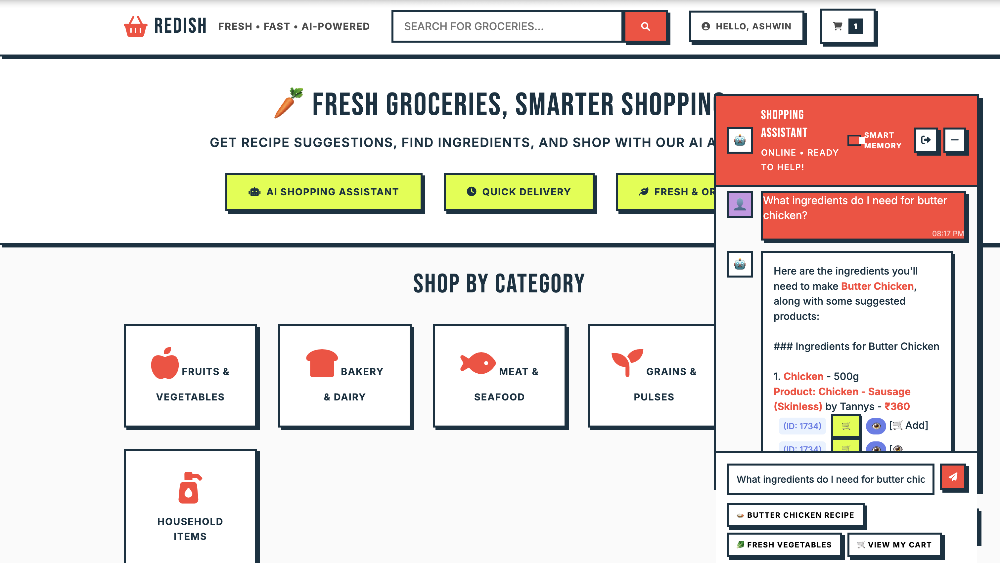

# 🛒 Shopping AI Agent with LangGraph.js

**Redis-powered grocery e-commerce with intelligent shopping assistance.**

Redish is an AI-powered grocery shopping platform that combines Redis's speed with LangGraph's intelligent workflow orchestration. Get personalized recipe recommendations, smart product suggestions, and lightning-fast responses through semantic caching.

## App screenshots



---

## Product Features

- **Smart Grocery Shopping**: AI-powered assistant helps you find ingredients, discover recipes, and manage your cart
- **Product Search**: Both text and vector-based search across grocery products with embeddings
- **Recipe Intelligence**: Get ingredient lists with suggested products for any recipe
- **Cart Management**: Add, view, and manage shopping cart items

## AI Features

- **Recipe Ingredients**: Ask for ingredients for any recipe and get suggested products
- **Product Search**: Find products by name, category, or description
- **Smart Recommendations**: AI suggests alternatives and complementary items
- **Cart Management**: Add, remove, and view cart items through natural conversation

## Technical features

- **Semantic Cache**: Similar queries return instantly using Redis LangCache
- **Vector Search**: Find products using AI-powered similarity search
- **Redis as memory layer**: for fast data retrieval
- **LangGraph Workflows**: AI agent routing, tool selection
- **Multi-tool Agent**: Recipe tools, search tools, cart tools, and knowledge tools

---

## Setup

- **OpenAI Version Setup**: See [openai-version/README.md](openai-version/README.md)
- **AWS Bedrock Version Setup**: See [aws-bedrock-version/README.md](aws-bedrock-version/README.md)
- **AWS Bedrock Guardrails**: See [aws-bedrock-version/docs/guardrails.md](aws-bedrock-version/docs/guardrails.md)

---

## 📁 Repository Structure

This repository contains two versions of the demo:

```
│ 
├── openai-version/       # OpenAI-powered version
│   ├── package.json
│   ├── index.js
│   ├── modules/
│   └── ...
│   └── README.md         # Setup instructions
│
├── aws-bedrock-version/  # AWS Bedrock version
│   ├── package.json
│   ├── index.js
│   ├── modules/
│   └── ...
│   └── README.md         # Setup instructions
└── README.md             # This file
```

## Quick Start

Choose your preferred AI provider:

### Option 1: OpenAI Version

```bash
cd openai-version
# Follow setup instructions in openai-version/README.md
```

### Option 2: AWS Bedrock Version

```bash
cd aws-bedrock-version
# Follow setup instructions in aws-bedrock-version/README.md
```

## 📋 Version Comparison

| Feature | OpenAI Version | AWS Bedrock Version |
|---------|----------------------|-------------------|
| **AI Provider** | OpenAI GPT-4 | AWS Bedrock Claude 3.5 Sonnet |
| **Embeddings** | OpenAI Embeddings | AWS Bedrock Titan Text Embeddings V2 |
| **AI Guardrails** | Basic content filtering | ✅ AWS Bedrock Guardrails |

---

## Tech Stack

### Core Technologies
- **Node.js** + **Express** (Backend API)
- **Redis** (Product store, agentic AI memory, conversational history, and semantic caching with Redis LangCache)
- **LangGraph** (AI workflow orchestration)
- **HTML + CSS + Vanilla JS** (Frontend)

### AI Providers
- **Main Version**: OpenAI API (GPT-4 for intelligent responses)
- **AWS Bedrock Version**: AWS Bedrock (Claude 3.5 Sonnet + Titan Text Embeddings V2)

---

## Architecture

The grocery agent uses a LangGraph-powered AI agent that routes requests through specialized tools.

1. **Cache Check**: First checks Redis semantic cache for similar queries
2. **AI Agent**: Routes to appropriate tools based on request type
3. **Specialized Tools**: Recipe ingredients, product search, cart operations, direct answers
4. **Modules Layer**: Product, cart, and chat modules
5. **Redis Storage**: Vector embeddings, semantic cache, and session data

### Project architecture

```
modules/
  ├── products/                # Product Business Component
  │   ├── api/                    # REST API endpoints
  │   ├── domain/                 # Business logic
  │   └── data/                   # Data access layer
  ├── cart/                    # Cart Business Component
  │   ├── api/
  │   ├── domain/
  │   └── data/
  ├──chat/                     # Chat/Cache Business Component
  │   ├── api/
  │   ├── domain/
  │   └── data/
  ├── ai/grocery-ai-agent/     # AI Agent
  │   ├── tools.js                # API/Interface Layer
  │   ├── nodes.js                # Agent Logic
  │   ├── index.js                # Orchestration
  │   └── state/                  # Data Access
```
---

## API Endpoints

- `POST /api/chat` - Main chat interface for AI shopping assistant
- `GET /api/products/search` - Search products with text/vector similarity
- `POST /api/cart/add` - Add items to shopping cart
- `GET /api/cart` - View cart contents
- `DELETE /api/cart` - Clear cart

---

## Contributing

1. Fork the repository
2. Create your feature branch (`git checkout -b feature/amazing-feature`)
3. Commit your changes (`git commit -m 'Add amazing feature'`)
4. Push to the branch (`git push origin feature/amazing-feature`)
5. Open a Pull Request

---

## Maintainers

- **Ashwin Hariharan** - [@booleanhunter](https://github.com/booleanhunter)

---

## License

This project is licensed under the MIT License - see the [LICENSE](/LICENSE) file for details.

---

## 🐞 Reporting Issues

If you find a bug or have a feature request, [open an issue](https://github.com/redis-developer/shopping-ai-agent-langgraph-js-demo/issues).

---