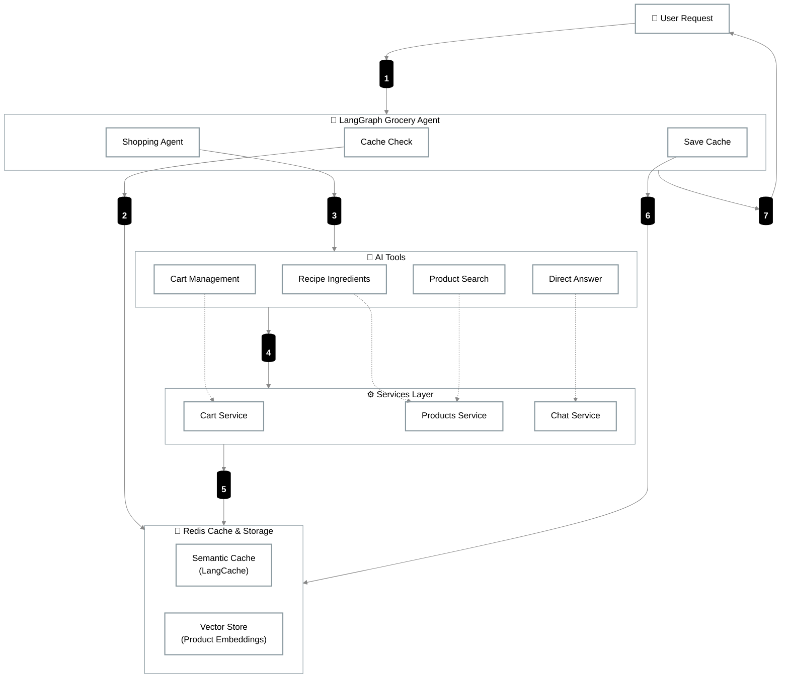

```mermaid
%%{init: {'theme':'base', 'themeVariables': {'primaryColor': '#888888', 'primaryTextColor': '#000000', 'primaryBorderColor': '#888888', 'lineColor': '#888888'}}}%%
graph TD
    %% User Layer
    User["👤 User Request"]
    
    %% LangGraph Agent Layer
    subgraph LangGraph["🤖 LangGraph Grocery Agent"]
        CacheCheck["Cache Check"]
        ShoppingAgent["Shopping Agent"]
        SaveCache["Save Cache"]
    end
    
    %% Cache Layer
    subgraph RedisCache["🔴 Redis Cache & Storage"]
        SemanticCache["Semantic Cache<br/>(LangCache)"]
        VectorStore["Vector Store<br/>(Product Embeddings)"]
    end
    
    %% Tools Layer
    subgraph AITools["🔧 AI Tools"]
        RecipeTool["Recipe Ingredients"]
        SearchTool["Product Search"]
        CartTool["Cart Management"]
        AnswerTool["Direct Answer"]
    end
    
    %% Services Layer
    subgraph ServicesLayer["⚙️ Services Layer"]
        CartService["Cart Service"]
        ProductService["Products Service"]
        ChatService["Chat Service"]
    end
    
    %% Step numbers (with fill for visibility)
    Step1[("1")]
    Step2[("2")]
    Step3[("3")]
    Step4[("4")]
    Step5[("5")]
    Step6[("6")]
    Step7[("7")]
    
    %% Flow connections with step numbers
    User --> Step1
    Step1 --> LangGraph
    CacheCheck --> Step2
    Step2 --> RedisCache
    ShoppingAgent --> Step3
    Step3 --> AITools
    AITools --> Step4
    Step4 --> ServicesLayer
    ServicesLayer --> Step5
    Step5 --> RedisCache
    SaveCache --> Step6
    Step6 --> RedisCache
    LangGraph --> Step7
    Step7 --> User
    
    %% Internal connections
    RecipeTool -.-> ProductService
    SearchTool -.-> ProductService
    CartTool -.-> CartService
    AnswerTool -.-> ChatService
    
    %% Step styling with black background and circular shape
    classDef stepStyle fill:#000000,color:#ffffff,stroke:#000000,stroke-width:2px,font-weight:bold
    classDef nodeStyle fill:transparent,color:#000000,stroke:#8a99a0,stroke-width:2px
    classDef subgraphStyle fill:#ffffff,color:#000000,stroke:#8a99a0,stroke-width:1px
    
    %% Apply step styling to numbered circles
    class Step1,Step2,Step3,Step4,Step5,Step6,Step7 stepStyle
    class User,CacheCheck,ShoppingAgent,SaveCache,SemanticCache,VectorStore,RecipeTool,SearchTool,CartTool,AnswerTool,CartService,ProductService,ChatService nodeStyle
    class LangGraph,RedisCache,AITools,ServicesLayer subgraphStyle
```