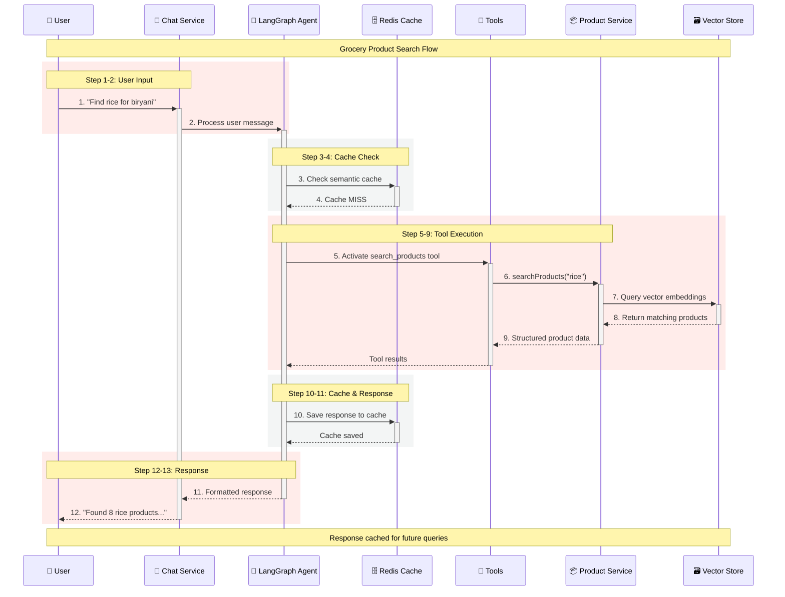

```mermaid
sequenceDiagram
    participant U as 👤 User
    participant C as 💬 Chat Service
    participant LG as 🤖 LangGraph Agent
    participant RC as 🗄️ Redis Cache
    participant T as 🔧 Tools
    participant PS as 📦 Product Service
    participant VS as 🗃️ Vector Store
    
    Note over U,VS: Grocery Product Search Flow
    
    rect rgba(255, 68, 56, 0.1)
        Note over U,C: Step 1-2: User Input
        U->>+C: 1. "Find rice for biryani"
        C->>+LG: 2. Process user message
    end
    
    rect rgba(138, 153, 160, 0.1)
        Note over LG,RC: Step 3-4: Cache Check
        LG->>+RC: 3. Check semantic cache
        RC-->>-LG: 4. Cache MISS
    end
    
    rect rgba(255, 68, 56, 0.1)
        Note over LG,PS: Step 5-9: Tool Execution
        LG->>+T: 5. Activate search_products tool
        T->>+PS: 6. searchProducts("rice")
        PS->>+VS: 7. Query vector embeddings
        VS-->>-PS: 8. Return matching products
        PS-->>-T: 9. Structured product data
        T-->>-LG: Tool results
    end
    
    rect rgba(138, 153, 160, 0.1)
        Note over LG,RC: Step 10-11: Cache & Response
        LG->>+RC: 10. Save response to cache
        RC-->>-LG: Cache saved
    end
    
    rect rgba(255, 68, 56, 0.1)
        Note over LG,U: Step 12-13: Response
        LG-->>-C: 11. Formatted response
        C-->>-U: 12. "Found 8 rice products..."
    end
    
    Note over U,VS: Response cached for future queries
```